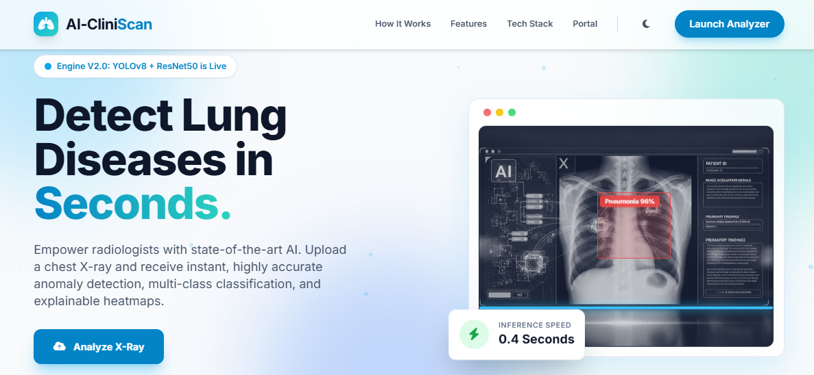
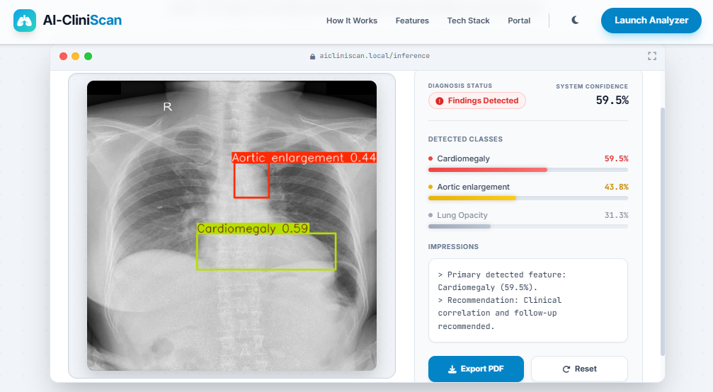
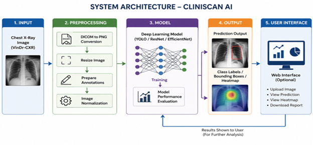

# 🫁 CliniScan AI  
## Intelligent Lung Abnormality Detection & Explainable Medical AI Platform

<div align="center">


# 🚀 End-to-End Medical AI System for Chest X-Ray Analysis

### Deep Learning • Detection • Explainable AI • FastAPI • Full Stack Deployment

*A production-grade AI platform designed to detect, classify, and localize lung abnormalities from chest X-ray images using advanced deep learning and explainable AI techniques.*

</div>

---

# 📸 Project Showcase

## 🏠 Home Interface

<div align="center">



</div>

---

## 📊 AI Prediction Output

<div align="center">



</div>

---

## 🏗️ System Architecture

<div align="center">



</div>

---

# 📌 Overview

**CliniScan AI** is a full-stack, production-grade Medical AI platform developed to assist radiologists and healthcare systems in detecting lung abnormalities from Chest X-ray (CXR) images.

The system combines:

- 🧠 Deep Learning Classification
- 📦 Object Detection
- 🔍 Explainable AI
- ⚙️ FastAPI Inference Services
- 🌐 Full-Stack Deployment
- 🐳 Dockerized Infrastructure

to create a scalable, intelligent, and clinically relevant AI-assisted diagnostic workflow.

---

# 🎯 Project Objective

The primary goal of CliniScan AI is to build an intelligent medical imaging system capable of:

- Detecting lung abnormalities
- Localizing affected regions
- Providing explainable visual outputs
- Improving diagnostic efficiency
- Supporting AI-assisted healthcare workflows

---

# 🧠 Core Features

# ✅ Multi-Disease Chest X-Ray Classification

- AI-based disease classification
- Multi-label prediction support
- EfficientNet & ResNet architectures

---

# 📦 YOLOv8 Abnormality Localization

- Detects suspicious lung regions
- Bounding-box based localization
- High-speed inference pipeline

---

# 🔍 Explainable AI with Grad-CAM

- Heatmap visualization
- Model interpretability
- Visual explanation for predictions
- Improved clinical transparency

---

# ⚙️ Real-Time FastAPI Backend

- Production-ready REST API
- Optimized inference serving
- Modular deployment architecture

---

# 🌐 Full-Stack Web Platform

Integrated frontend with:

- Upload interface
- Live predictions
- Visualization dashboard
- Interactive AI outputs

---

# 🐳 Dockerized Deployment

- Containerized architecture
- Easy deployment & portability
- Reproducible environment setup

---

# ☁️ Cloud Deployment

Hosted on:

- Hugging Face Spaces

for accessible public demonstrations.

---

# 🧠 AI Models

| Component | Model |
|---|---|
| Classification | EfficientNet / ResNet |
| Detection | YOLOv8 |
| Explainability | Grad-CAM |

---

# 📊 Dataset

## 🏥 VinDr-CXR Dataset

A large-scale medical imaging dataset containing:

- 18,000+ Chest X-rays
- Bounding-box annotations
- Multi-disease labels
- Radiologist-verified abnormalities

### 🔗 Dataset Link

https://physionet.org/content/vindr-cxr/1.0.0/

---

# ⚙️ Tech Stack

# 📊 Data Processing

- pydicom
- OpenCV
- NumPy
- Pandas

---

# 🧠 AI / Deep Learning

- PyTorch
- YOLOv8
- EfficientNet
- ResNet
- Grad-CAM

---

# ⚙️ Backend

- FastAPI
- Uvicorn

---

# 🎨 Frontend

- React
- HTML5
- CSS3
- JavaScript

---

# 🚀 Deployment

- Docker
- Hugging Face Spaces

---

# 🌐 Live Demo

## 🚀 Try CliniScan AI

https://huggingface.co/spaces/shubhamsalunke/CliniScan-Pro

---

# 📈 Model Performance

| Model | Task | Metric | Score |
|---|---|---|---|
| EfficientNet | Classification | AUC | 0.88 |
| YOLOv8 | Detection | mAP@0.5 | 0.75 |

---

# 🔄 End-to-End Workflow

```text
Chest X-Ray Upload
        ↓
DICOM Preprocessing
        ↓
Deep Learning Inference
        ↓
Disease Classification
        ↓
Abnormality Localization
        ↓
Grad-CAM Explainability
        ↓
FastAPI Response
        ↓
Frontend Visualization
```

---

# 🏗️ Repository Structure

```bash
CliniScanAI/
│
├── deployment/
│   ├── backend/
│   ├── frontend/
│   └── Dockerfile
│
├── models/
│   ├── classification/
│   ├── detection/
│   └── explainability/
│
├── notebooks/
│   ├── preprocessing.ipynb
│   ├── training.ipynb
│   └── evaluation.ipynb
│
├── output/
│   ├── home.png
│   ├── output.png
│   └── system_arrchitecture.png
│
├── requirements.txt
├── README.md
└── app.py
```

---

# ⚡ Run Locally

# 1️⃣ Clone Repository

```bash
git clone https://github.com/your-username/CliniScanAI-Lung-Abnormality-Detection.git
```

---

# 2️⃣ Navigate to Project

```bash
cd CliniScanAI-Lung-Abnormality-Detection
```

---

# 3️⃣ Install Dependencies

```bash
pip install -r requirements.txt
```

---

# ▶️ Start Backend Server

```bash
uvicorn deployment.backend.main:app --reload
```

---

# ▶️ Launch Frontend

```bash
open output/home.png
```

---

# 🐳 Docker Deployment

# 🔨 Build Container

```bash
docker build -t cliniscan-ai .
```

---

# ▶️ Run Container

```bash
docker run -p 8000:8000 cliniscan-ai
```

---

# 🏆 Project Highlights

✔ End-to-End Medical AI System  
✔ Real-Time Chest X-Ray Analysis  
✔ Explainable AI Integration  
✔ Full-Stack Deployment  
✔ YOLOv8 Detection Pipeline  
✔ Production-Ready FastAPI Backend  
✔ Dockerized Infrastructure  
✔ Hugging Face Deployment  
✔ Clinical Imaging Dataset Usage  

---

# 🧪 Research & Engineering Focus

- Medical Image Intelligence
- AI-Assisted Diagnosis
- Explainable AI Systems
- Clinical Workflow Optimization
- Full-Stack AI Engineering
- Real-Time Inference Systems

---

# 🚀 Future Enhancements

- 🧠 Vision Transformer Integration
- ☁️ Cloud-Scale Deployment
- 📱 Mobile Medical Interface
- 🔬 Multi-Modal Medical AI
- 📊 Advanced Clinical Analytics
- 🩺 Radiologist Feedback Loop
- 🤖 Automated Report Generation

---

# 🏅 Development Milestones

## 🟢 Phase 1 — Data Pipeline

- DICOM preprocessing
- Dataset preparation
- Annotation handling

---

## 🟡 Phase 2 — Deep Learning Models

- CNN classification models
- Detection training
- Baseline evaluation

---

## 🟠 Phase 3 — Explainable AI

- Grad-CAM integration
- Visual interpretability
- Model transparency improvements

---

## 🔵 Phase 4 — Deployment & Integration

- FastAPI backend
- Frontend integration
- Docker deployment
- Hugging Face hosting

---

# 🤝 Contribution

Contributions are welcome.

## Contribution Workflow

```bash
1. Fork Repository
2. Create Feature Branch
3. Commit Changes
4. Push Changes
5. Open Pull Request
```

---

# 📜 License

MIT License

---

# 👨‍💻 Author

# Shubham Salunke

### 🚀 Full Stack AI Developer • Medical AI Enthusiast • System Architect

Focused on:
- Medical AI Systems
- Explainable Deep Learning
- AI Deployment Engineering
- Healthcare Technology
- Real-Time Inference Platforms

---

<div align="center">

# 🫁 Advancing AI-Powered Healthcare Through Intelligent Medical Imaging

### Deep Learning • Explainability • Clinical Intelligence • Full Stack AI

Made with ❤️ using AI & Modern Medical Imaging Technologies

</div>
